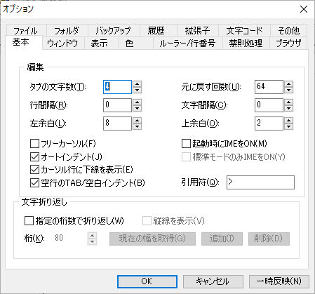
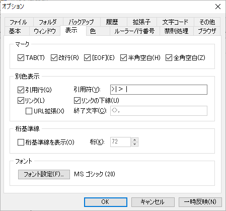
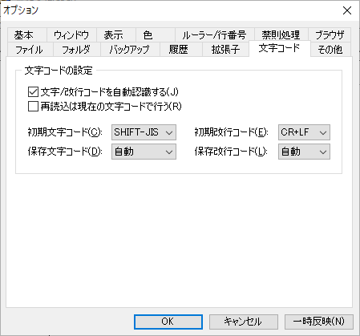

# Terapadの設定

## [表示]メニュー - オプション

### [基本]タブ

- [タブの文字数]は「4」
- 以下の設定にチェックを入れる
  - オートインデント
  - カーソル行に下線を表示
  - 空行のTAB/空白インデント
  

### [表示]タブ

- 以下の[マーク]グループをすべてチェックする
  - TAB
  - 改行
  - EOF
  - 半角空白
  - 全角空白

### [文字コード]タブ

- 文字/改行コードを自動認識するにチェックで、
- [初期文字コード]は「SHIFT-JIS」にします

