# 環境設定ファイル(2021/01/04 tokuzato)

## Visual Studio Code VSCodeUserSetup-x64-1.58.2インストール

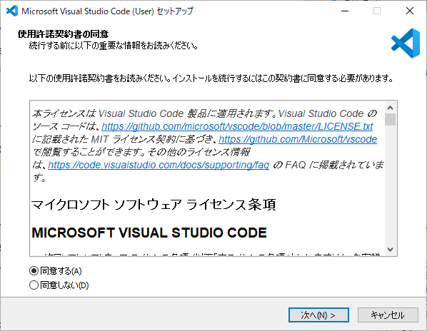

   

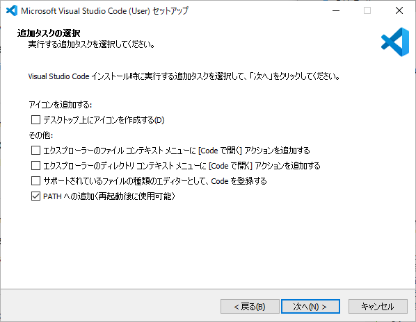

   

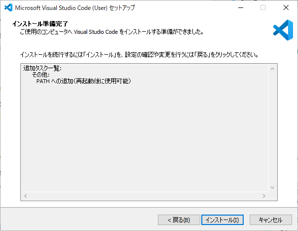

   

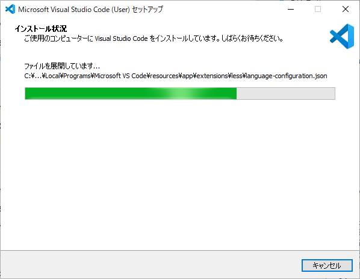

   

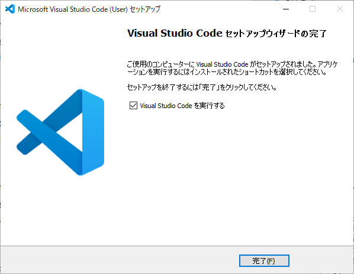

   

### 拡張機能①-日本語化 ]■
  1. 左メニューのアイコン《Extensions》（拡張機能）を選択
  2. 検索窓に《japanese》を入力

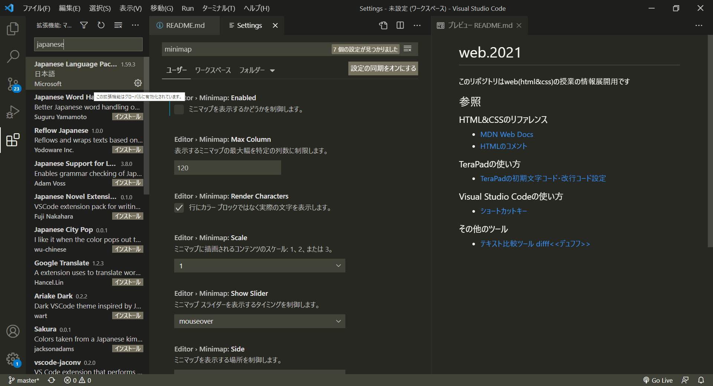

  3. 検索一覧より《Japanese Language Pack for VS Code》を選択
  4. 緑のボタン《Install》を選択
  5. ウィンドウ右下の青いボタン《Restart Now》（再起動）を選択
#### 追加した機能
- VSCodeの日本語化パック Japanese Language Pack for VS Code

### 基本設定①-フォントサイズの変更
  1. メニューバーの《ファイル》＞ 《ユーザー設定》 > [設定]画面　（または左下の[⚙]アイコン＞ [設定]）

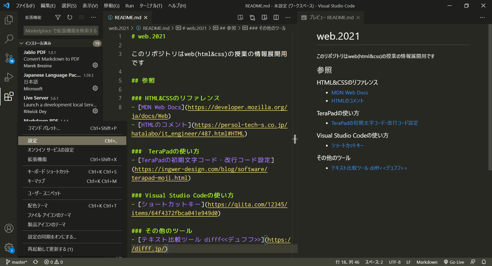

  2. 《よく使用するもの》一覧のより《Editor: Font Size》（フォントサイズ(ピクセル単位)を制御します。）を選択
  3. 《14》から半角数値で《18》（好きな値でも可）に変更する。*エンターしなくても自動保存される。

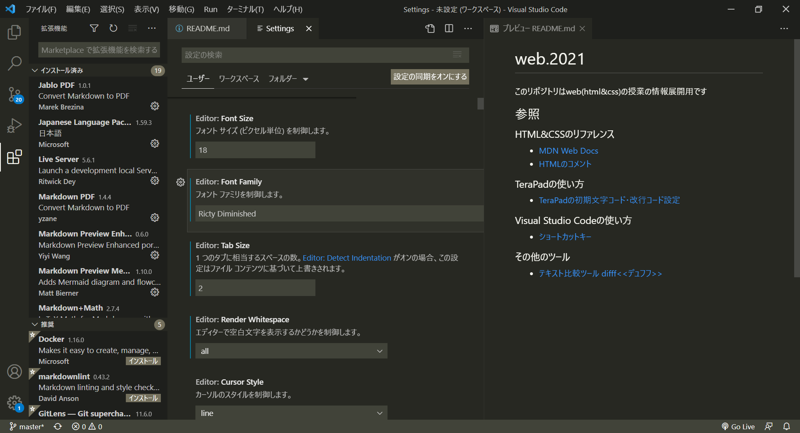

### 基本設定②-タブサイズの変更
  1. 《よく使用するもの》一覧のより《Editor: Tab Size》（1つのタブに相当するスペースの数）を選択
  2. 《4》から半角数値で《2》に変更する。*エンターしなくても自動保存される。

### 基本設定③-半角スペースなど空白文字を表示
  1. 《よく使用するもの》一覧のより《Editor: Render Whitespace》（エディターで空白文字を表示するかどうかを制御します。）を選択
  1. 《selection》から《all》に変更する。

### 基本設定④-行の折り返し方法
  1. 《よく使用するもの》一覧のより《Editor: Word Wrap》（行の折り返し方法を制御します。）を選択
  2. 《off》から《on》に変更する。

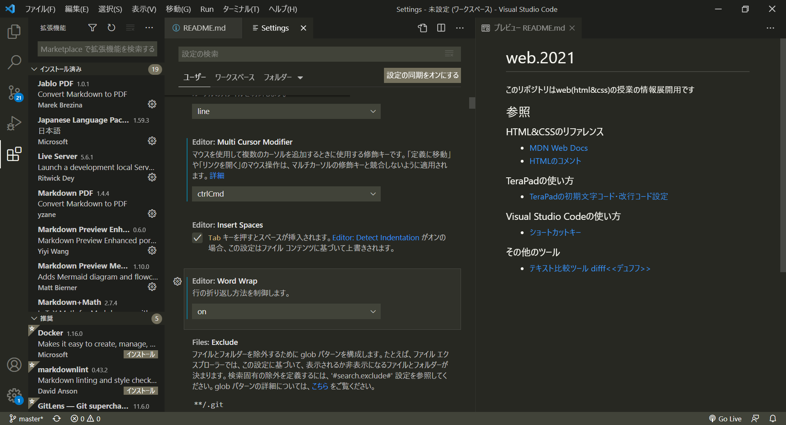

### 基本設定⑤-ミニマップの非表示
ソースが長くなると右上にソース全体像「ミニマップ」が表示されて少し邪魔になるので非表示にします。
  1. 左メニューの《テキストエディター》一覧より《ミニマップ》を選択
  2. 《Enabled》（ミニマップを表示するかどうかを制御します。）の☑を外して非表示にする

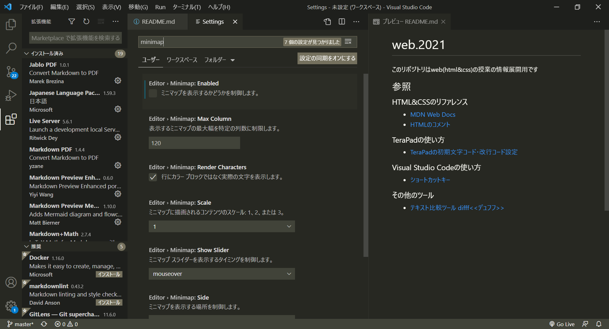

### 拡張機能②-全角スペースの表示
全角スペースの表示は拡張機能で可能になります。事故の元になるので必ず入れましょう。
  1. 左メニューから一番下の《拡張機能》アイコンを選択
  2. 検索窓に《zenkaku》を入力

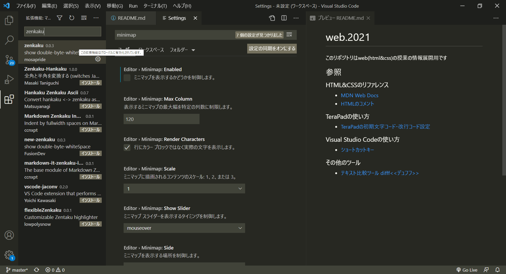

  3. 検索結果一覧より《zenkaku》の《インストール》を選択し、全角スペースを入力してハイライトされることを確認

#### 有効化されていない場合
  1. 《F1》キーを選択しコマンドを半角英字で《zenkaku》と入力

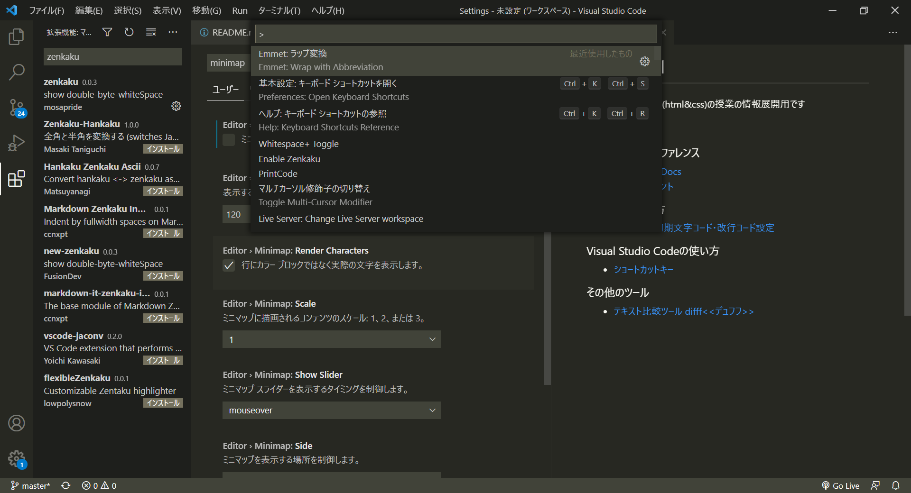

  2. 一覧から《Enable Zenkaku》（Zenkakuを有効化）を↓キーで選択し、エンターで確定する。

#### 《zenkaku》を常に適用にする
  1. VSCodeのプログラムが入っているフォルダを開く。
《C:ドライブ》＞《ユーザー》＞《.vscode》＞《extensions》＞《mosapride.zenkaku-0.0.3》＞《extension.js》をVSCodeで開く。
＊インストールしたPC環境によってディレクトリパスが各自で異なる場合があり。《.vscode》以下は同じです。

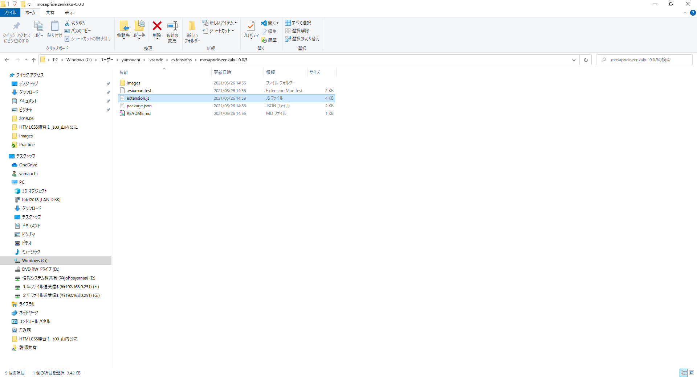

  2.  5行目の《var enabled = false;》を《var enabled = true;》に変更し、上書き保存をしてファイルを閉じる。

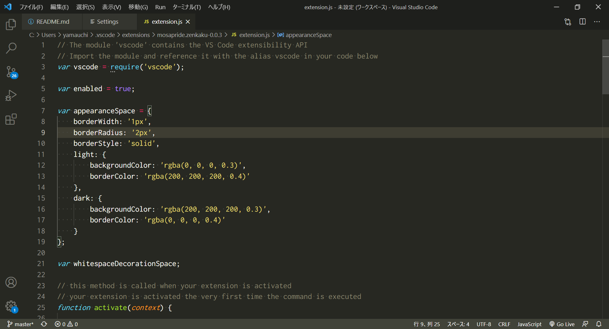

  3. 再起動すると、直後から常に《zenkaku》の拡張機能が有効かされた状態になる。

#### 追加した機能
- 全角スペースをハイライトする zenkaku

### 拡張機能③-自動整形
Ctrl+Shift+Fで整形(フォーマット)が全で可能ですがめんどくさいので、ペースト及び保存時に
  1. メニューバーの《ファイル》＞ 《ユーザー設定》 > [設定]画面　（または左下の[⚙]アイコン＞ [設定]）
  2. 検索窓に「format」を入力
  3. 検索結果の以下を設定
      1. Editor:Default Formatter => 「HTML 言語機能」を選択
      2. Editor:Format On Paste => チェックを入れる
      3. Editor:Format On Save => チェックを入れる

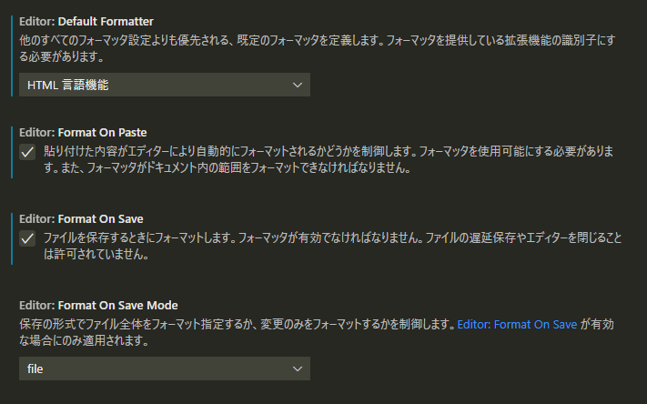

### 配色テーマ設定
1. 《ファイル》から《基本設定》にロールオーバーし、《配色テーマ》を選択
2. 上部コマンド入力欄より一覧が表示される。
3. 各配色のプレビューを確認するため、上下方向キー（↑↓）で確認
4. 授業で使用する配色《Light（Visual Studio Code）》（好きな色を選択しても可）をエンタキーで選択し適用

- 人気の配色は、《Monokai》です。
  - 有名なテキストエディタ《Sublime Text（サブライムテキスト）》の基本配色で、
- 目に優しい黒背景かつコードの視認性が高いため。

### 諸注意
- 《F11》キーを押してしまうと、エディターのウィンドウが全画面表示となりメニューバーが非表示となる。
- もう一度《F11》キーを押すとエディターのウィンドウ表示を元に戻せます。
